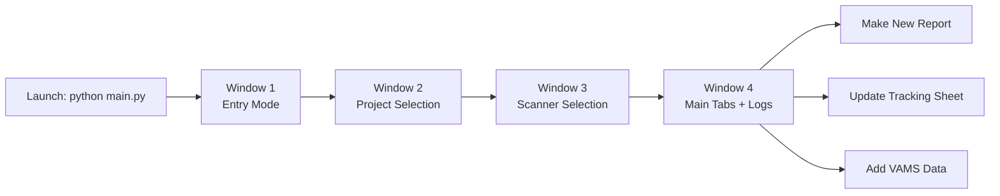
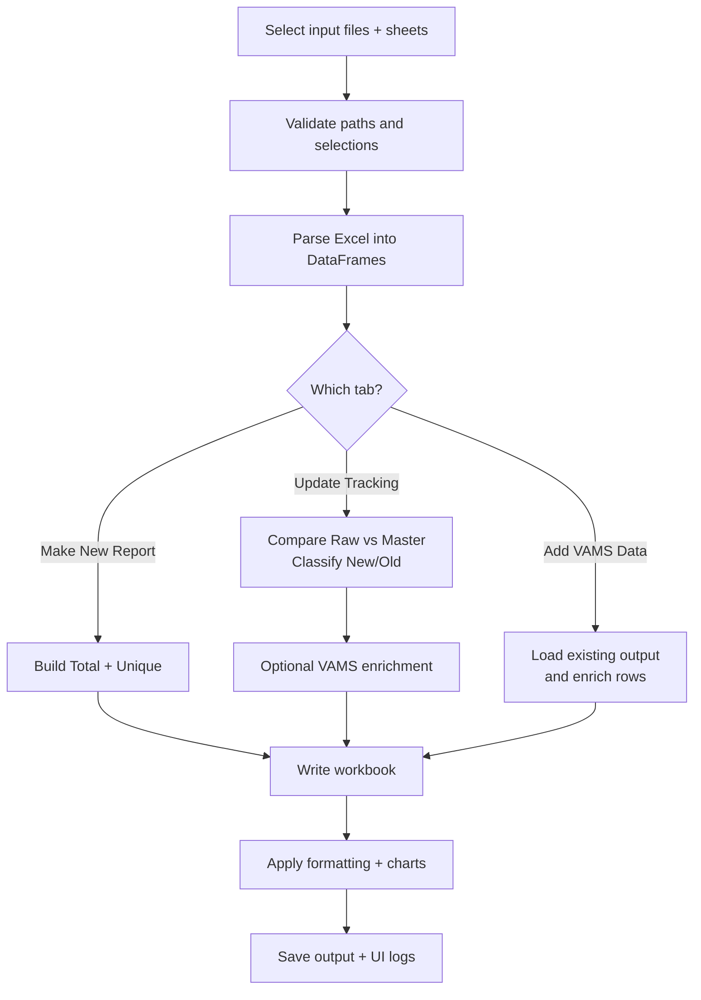

# 🛡️ Vulnerability Management Excel Automation

<p align="center">
  <b>GUI-based automation for vulnerability reporting, enrichment, and dashboard-ready Excel outputs.</b>
</p>

<p align="center">
  
  
  
  
</p>

---

## ✨ What this project does

This desktop application automates repetitive vulnerability-reporting tasks by:
- Parsing scanner exports.
- Comparing **Raw vs Master** findings.
- Enriching findings with **VAMS** fields.
- Generating a standardized, formatted Excel workbook with dashboards and charts.

### Main tabs
1. **Make New Report** → Build a fresh workbook from raw input.
2. **Update Tracking Sheet** → Classify new/old + optional VAMS enrichment.
3. **Add VAMS Data** → Enrich an already generated workbook.

---

## 📦 Requirements

### Runtime
- Python **3.10+** (recommended: 3.11/3.12)
- OS environment with GUI support
- `tkinter` available (bundled in most Python installers)

### Python dependencies

```bash
pip install pandas openpyxl
```

---

## 🚀 Quick Start

```bash
python main.py
```

Then follow the wizard:
1. Select **Entry Mode** (VNF/CNF)
2. Select **Project**
3. Select **Scanner**
4. Open main workspace and run one of the 3 tabs

---

## 🧭 Application Workflow

### User journey (UI flow)



### Data processing flow



---

## ⚙️ Execution Details

- Entry point: `main.py`
- Runtime trigger:
  - `if __name__ == "__main__": App().mainloop()`
- Each tab has a **Run** button that executes:
  1. input validation,
  2. parse/transform/enrich,
  3. workbook write,
  4. final formatting,
  5. log + status popup.

---

## 🧩 Codebase Map (`.py` files)

## Root
- **`main.py`**
  - Tk root app.
  - Shared state storage.
  - Window routing (wizard → main tabs).

## `gui/`
- **`gui/window1_entry.py`** → Entry mode selection (VNF/CNF).
- **`gui/window2_project_selection.py`** → Project selection UI.
- **`gui/window3_scanner_selection.py`** → Scanner selection UI.
- **`gui/window4_main.py`** → Tab container + live log panel.

## `tabs/`
- **`tabs/make_new_report.py`**
  - Raw-only flow.
  - Builds total + unique vulnerability data.
  - Writes formatted workbook with dashboard.

- **`tabs/generate_tracking.py`**
  - Raw + optional master comparison flow.
  - Produces **new / old / unique** datasets.
  - Optional VAMS enrichment.
  - Writes formatted workbook output.

- **`tabs/add_vams_data.py`**
  - Re-opens generated workbook.
  - Reads total/unique target sheets.
  - Enriches rows using VAMS data (fast-key matching).
  - Updates summary/formatting and saves.

## `logic/`
- **`logic/parser.py`**
  - Normalizes scanner exports into template columns.
  - Applies validation and severity filtering.

- **`logic/comparison_logic.py`**
  - Classifies findings into new vs old.
  - Builds unique aggregation.
  - Contains VAMS enrichment helpers.

- **`logic/vams_enrichment.py`**
  - VAMS column definitions + enrichment behavior.

- **`logic/fast_vams_enrichment.py`**
  - High-performance VAMS matching engine for larger datasets.

- **`logic/summary_generator.py`**
  - Builds summary tables for dashboard metrics/charts.

- **`logic/highlight_logic.py`**
  - Severity-to-color mapping for Excel highlighting.

## `logic/excel_writer/`
- **`logic/excel_writer/__init__.py`**
  - Exposes excel-writer package API.

- **`logic/excel_writer/workbook.py`**
  - Workbook orchestration, sheet ordering, save flow.

- **`logic/excel_writer/sheets.py`**
  - Writes data sheets, dashboard sheets, and charts.

- **`logic/excel_writer/reader.py`**
  - Reads generated sheets back into DataFrames.
  - Header alias handling.

- **`logic/excel_writer/formatting.py`**
  - Shared formatting styles/utilities (headers, borders, widths, alignment).

- **`logic/excel_writer/three_uk_qualys.py`**
  - Specialized logic for **3UK + Qualys** layout and mapping.

## `utils/`
- **`utils/file_handler.py`** → File checks + Excel sheet listing.
- **`utils/logger.py`** → Logger setup + UI log handler support.

---

## 🧠 Whole Functioning (in one view)

This is a **GUI-driven ETL + reporting pipeline**:
- **Extract**: read scanner/VAMS Excel sheets.
- **Transform**: normalize columns, compare data, classify risk state, enrich with VAMS.
- **Load/Report**: generate standardized output workbook with summary dashboard, vulnerability sheets, and formatting/charts.

Result: consistent, repeatable vulnerability reporting with less manual Excel effort.
