# Full Project Documentation (Architecture, Logic, Workflow, Computation, DSA, Optimization)

## 1) Project Purpose
This project is a Tkinter desktop application for vulnerability Excel automation. It parses scan files, compares datasets, enriches with VAMS metadata, and generates formatted output workbooks with dashboard charts.

---

## 2) Whole-System Architecture
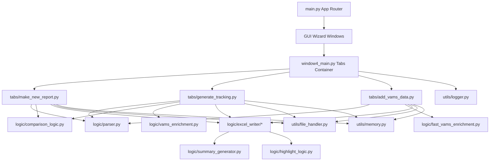

---

## 3) Runtime Workflow (User + Compute)
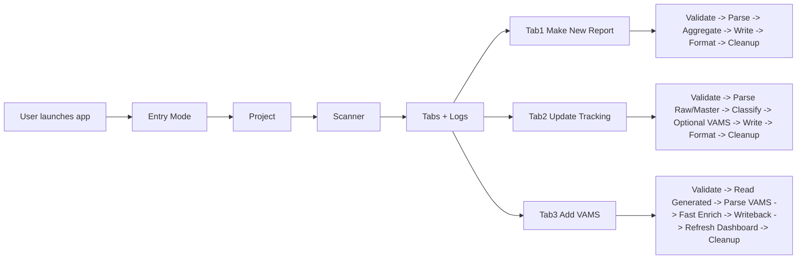

---

## 4) Imports and Dependency Map
- Standard library: `tkinter`, `logging`, `pathlib`, `re`, `gc`, `tracemalloc`, `dataclasses`, `typing`.
- Third-party: `pandas`, `openpyxl`.
- Internal packages:
  - `gui/*`
  - `tabs/*`
  - `logic/*`
  - `logic/excel_writer/*`
  - `utils/*`

---

## 5) Computation, DSA, Algorithms, Optimizations

### 5.1 Parsing & Normalization (`logic/parser.py`)
- **Algorithm**: header-row heuristic scoring + alias-based canonical mapping.
- **DSA**: dictionaries for alias lookup and normalization mapping.
- **Complexity**:
  - header detection: `O(r*g)` (preview rows × keyword groups)
  - normalization: approx `O(n*c)` (rows × target columns)
- **Optimization**: normalization aliases reduce scanner format coupling.

### 5.2 New/Old Classification (`logic/comparison_logic.py`)
- **Algorithm**: build deterministic keys and set-membership compare.
- **DSA**: hash-set membership.
- **Complexity**: near `O(n)` average membership checks.
- **Optimization**: avoids nested loops.

### 5.3 Unique Aggregation (`logic/comparison_logic.py`)
- **Algorithm**: group-by `(Name, CVE, Host / Image)` and de-dup merge.
- **DSA**: hash-grouping (`pandas groupby`) + stable merge lists.
- **Complexity**: near linear average in practice (pandas internals apply).

### 5.4 VAMS Enrichment (`logic/vams_enrichment.py`, `logic/fast_vams_enrichment.py`)
- **Algorithm**: tiered key matching with fallback combinations (host/name/cve/scanner/port).
- **DSA**: hash-map lookup + regex/token parsers.
- **Complexity**: `O(n*k)` key generation where `k` is tiered-key expansion.
- **Optimization**: fast-lookup precomputation avoids brute-force row-by-row nested matching.

### 5.5 Excel Generation (`logic/excel_writer/*`)
- **Algorithm**: sequential sheet writing + style passes + chart embedding.
- **DSA**: list/loop traversal.
- **Complexity**: formatting/writes roughly `O(rows*cols)`.
- **Optimization**: shared formatting helpers and reusable chart-source builders.

---

## 6) Memory Usage and Lifecycle

### Where memory is consumed most
1. `pandas.read_excel()` for raw/master/vams sheets.
2. Holding multiple DataFrames simultaneously (Tab2 highest).
3. `openpyxl` workbook object during write/save/format operations.

### What was added to control memory
- `utils/memory.py`
  - `memory_session(logger, label)` tracks `tracemalloc` current/peak.
  - `release_large_objects(...)` deletes heavy references and runs `gc.collect()`.
- Applied in all three tabs to force release after task completion.

### Approximate footprint behavior (depends on input size)
- Small file (<10k rows): tens of MB.
- Medium file (10k–100k rows): hundreds of MB possible.
- Large file (>100k rows with many columns): can exceed 1 GB when multiple DataFrames + workbook coexist.

---

## 7) Functional `def()` Flow and Flowcharts for All `.py` Files

## 7.1 `main.py`
- Class: `App`
- Flow: init state -> create container -> show wizard windows -> open tabbed workspace.
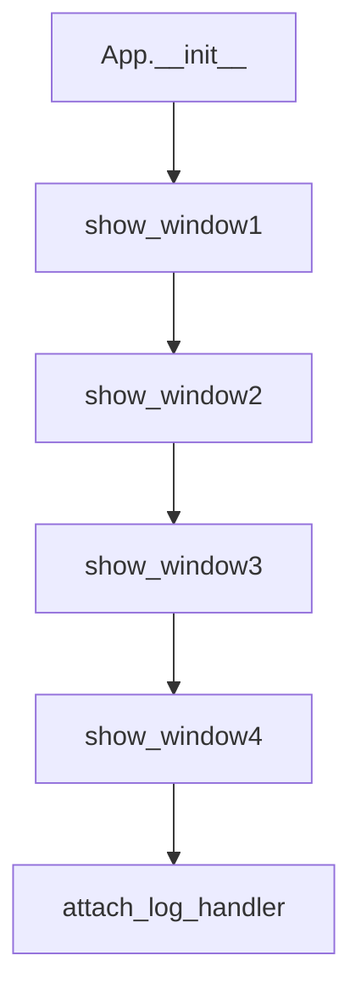

## 7.2 `gui/window1_entry.py`
- Class: `Window1Entry`
- Methods: `_build`, `_next`
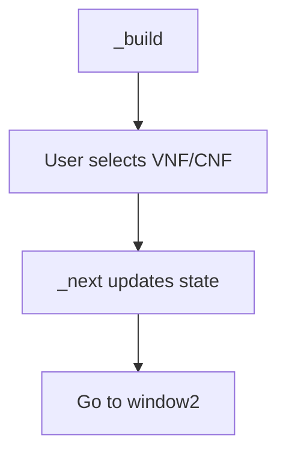

## 7.3 `gui/window2_project_selection.py`
- Class: `Window2ProjectSelection`
- Methods: `_build`, `_next`
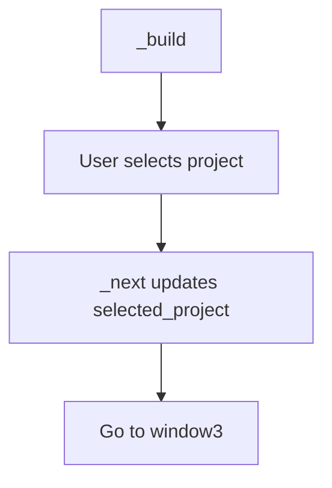

## 7.4 `gui/window3_scanner_selection.py`
- Class: `Window3ScannerSelection`
- Methods: `_build`, `_next`
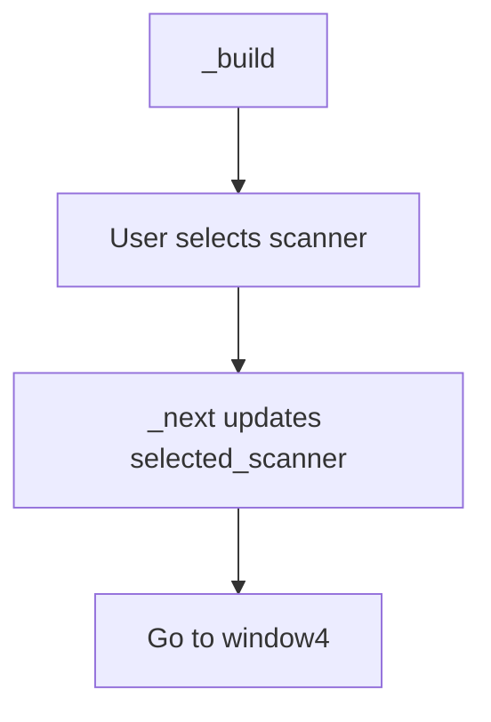

## 7.5 `gui/window4_main.py`
- Class: `Window4Main`
- Methods: `_build`, `attach_log_handler`, `append_log`
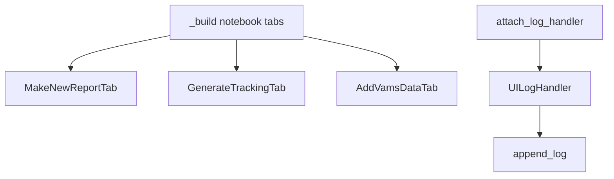

## 7.6 `tabs/make_new_report.py`
- Class: `MakeNewReportTab`
- Core method: `run()`
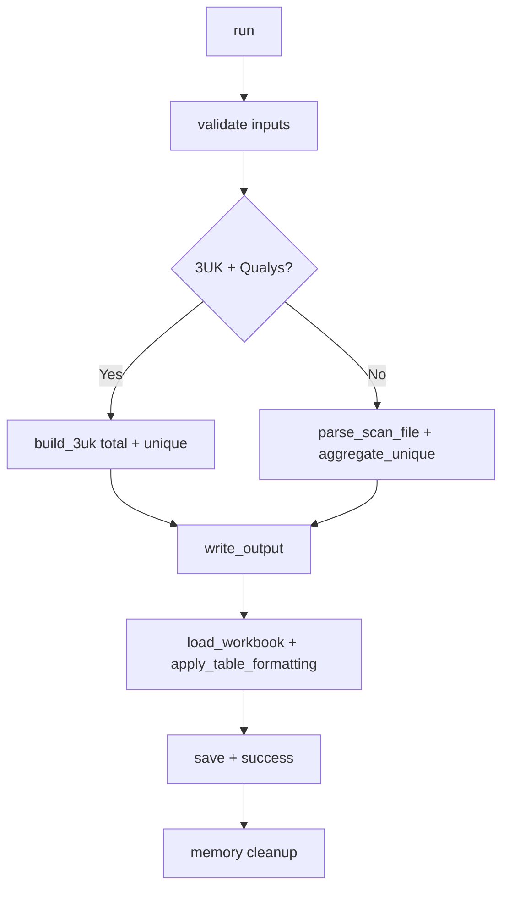

## 7.7 `tabs/generate_tracking.py`
- Class: `GenerateTrackingTab`
- Core method: `run()`
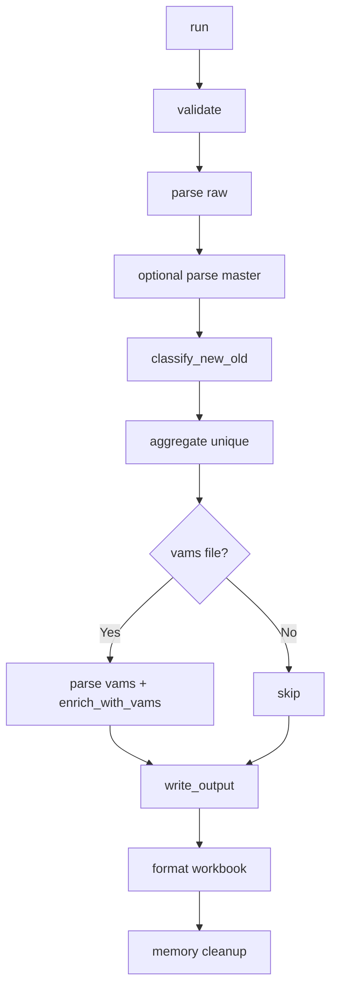

## 7.8 `tabs/add_vams_data.py`
- Class: `AddVamsDataTab`
- Key methods: `_read_generated_sheet`, `_write_vams_columns_only`, `_refresh_dashboard_charts`, `run`
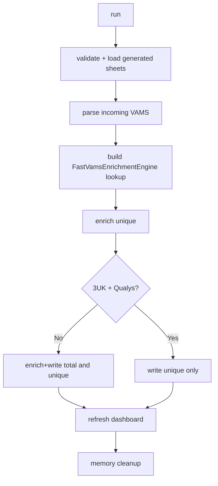

## 7.9 `utils/file_handler.py`
- Functions:
  - `validate_file(path)`
  - `list_excel_sheets(path)`
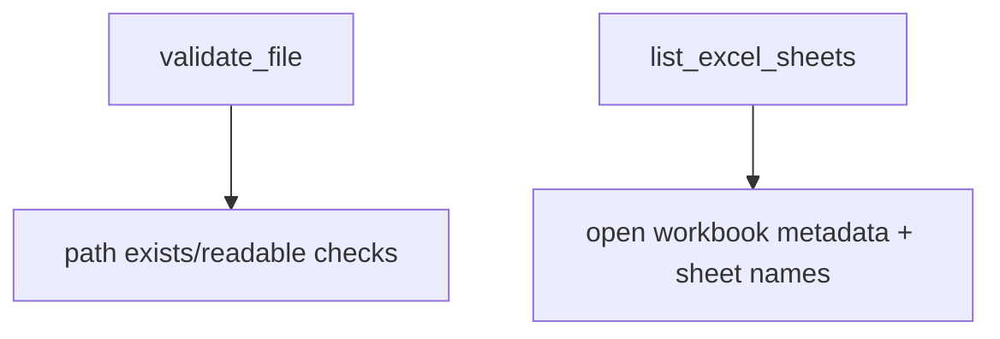

## 7.10 `utils/logger.py`
- Class: `UILogHandler`
- Function: `get_logger(...)`
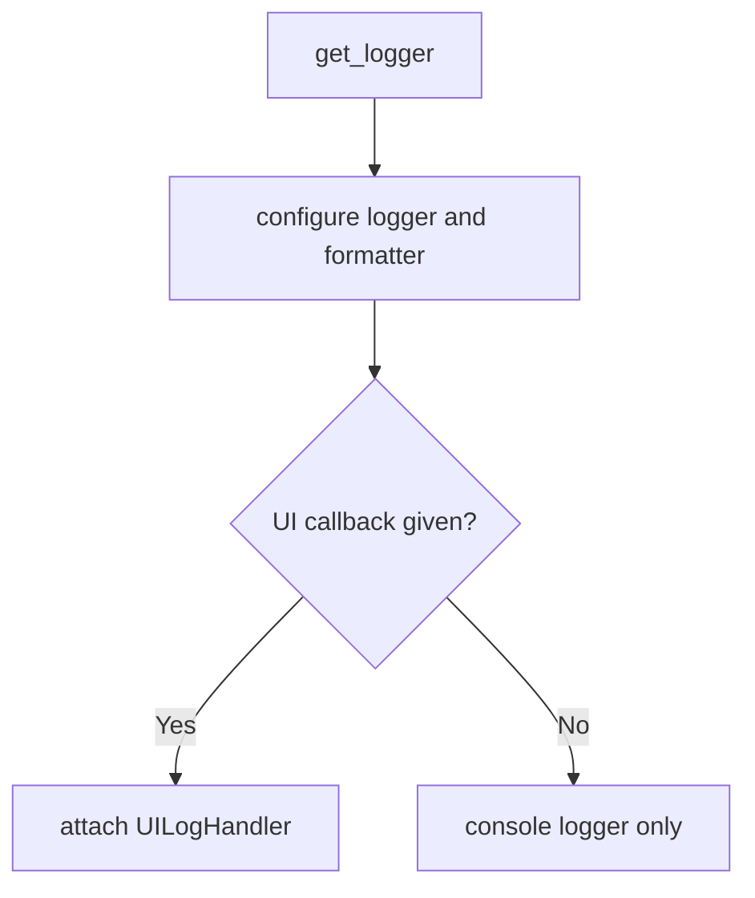

## 7.11 `utils/memory.py`
- Functions:
  - `memory_session(logger, label)`
  - `release_large_objects(namespace, names)`
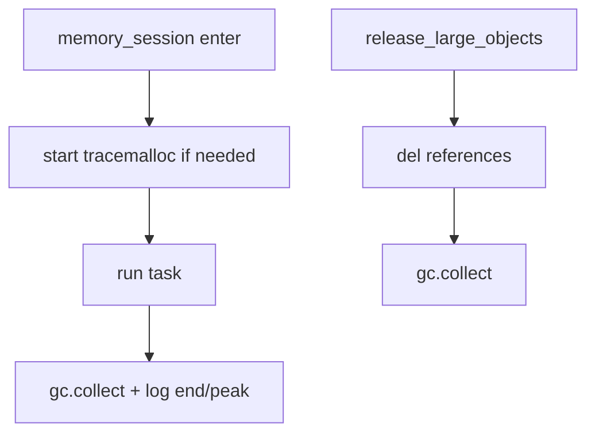

## 7.12 `logic/parser.py`
- Main functions/classes: `ParsedData`, `norm_text`, `split_values`, `merge_semicolon`, `highest_risk`, `detect_header_row`, `_mapped_series`, `normalize_columns`, `parse_scan_file`, `filter_severity`, `build_key`.
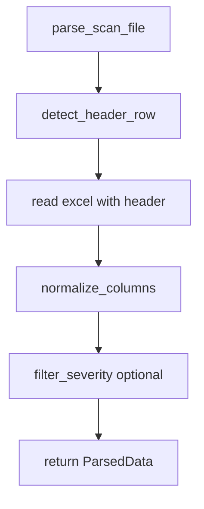

## 7.13 `logic/comparison_logic.py`
- Functions: `classify_new_old`, `aggregate_unique`
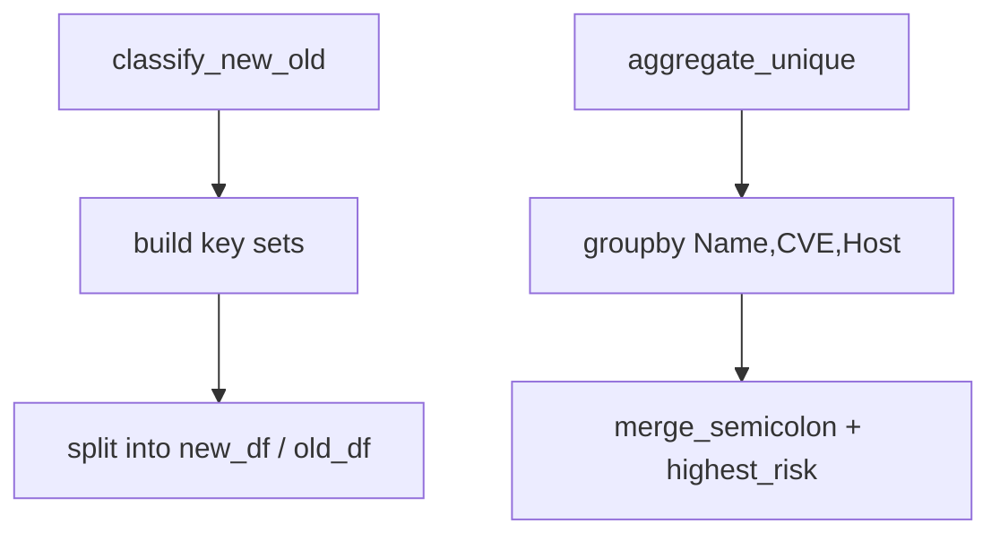

## 7.14 `logic/vams_enrichment.py`
- Functions: normalization helpers, token extraction, key construction, `enrich_with_vams`, `update_vams_existing_workbook`.
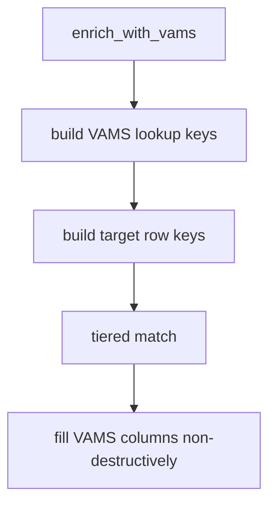

## 7.15 `logic/fast_vams_enrichment.py`
- Functions: key-building helpers + `build_fast_keys`.
- Class: `FastVamsEnrichmentEngine` (`build_vams_lookup`, `enrich`, internal match).
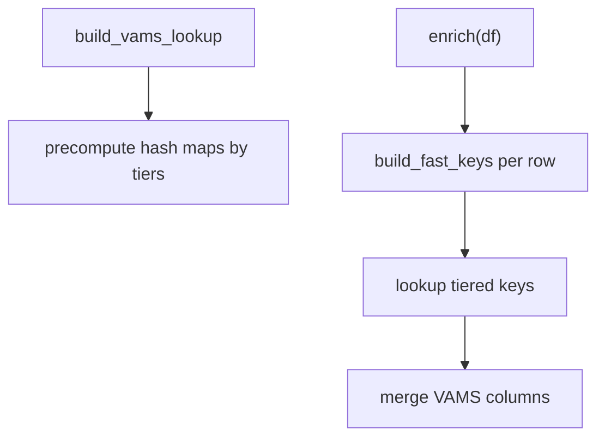

## 7.16 `logic/summary_generator.py`
- Functions: severity and disposition summaries.
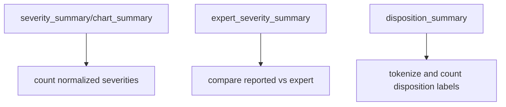

## 7.17 `logic/highlight_logic.py`
- Function: `severity_fill`.
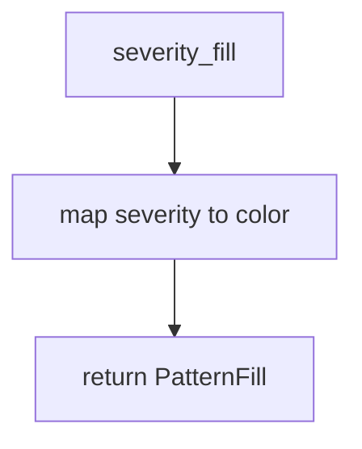

## 7.18 `logic/excel_writer/formatting.py`
- Functions: `style_meta_row`, `write_headers`, `write_summary_headers`, `apply_table_formatting`, `auto_width`.
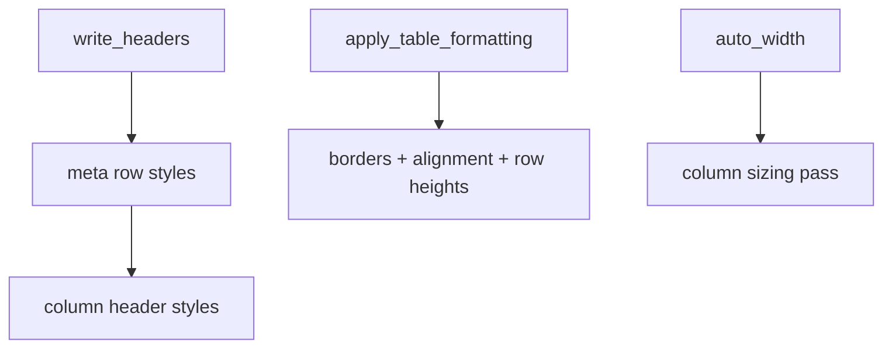

## 7.19 `logic/excel_writer/reader.py`
- Functions: `_normalized_header`, `_fill_from_display_alias`, `read_sheet_as_df`.
```mermaid
flowchart TD
    A[read_sheet_as_df] --> B[read header row 2]
    B --> C[fill target fields using aliases]
    C --> D[return TEMPLATE_COLUMNS dataframe]
```

## 7.20 `logic/excel_writer/workbook.py`
- Functions: `_normalized_sheet_name`, `normalize_total_sheet_name`, `autofit_worksheet_columns`, `write_output`.
```mermaid
flowchart TD
    A[write_output] --> B[create workbook]
    B --> C{include dashboard?}
    C -->|Yes| D[write_summary_sheet]
    C -->|No| E[first data sheet]
    D --> F[write new/old/unique/disposition]
    E --> F
    F --> G[save workbook]
```

## 7.21 `logic/excel_writer/sheets.py`
- Functions for data rows, dashboard chart data, pie/bar chart creation, sheet writers.
```mermaid
flowchart TD
    A[write_main_sheet] --> B[headers + rows + freeze panes + width]
    C[write_summary_sheet] --> D[summary tables]
    D --> E[pie/bar charts]
    F[write_disposition_sheet] --> G[disposition view]
```

## 7.22 `logic/excel_writer/three_uk_qualys.py`
- Functions for 3UK+Qualys detection, header detection, mapping, total/unique builders.
```mermaid
flowchart TD
    A[build_3uk_qualys_total_sheet_df] --> B[detect_qualys_header_row]
    B --> C[map raw qualys fields]
    C --> D[criticality/risk transformations]
    D --> E[return standardized total DF]
    F[build_3uk_qualys_unique_sheet_df] --> G[group/map into unique template]
```

## 7.23 `logic/excel_writer/__init__.py`
- Re-exports public writer APIs for simple imports.

---

## 8) Practical Optimization Recommendations (Next Steps)
1. Use `usecols=` in `pd.read_excel` where feasible.
2. Convert high-cardinality string columns to categoricals for large workflows.
3. Process large files in stages/chunks when possible.
4. Skip global formatting passes on sheets that are unchanged.
5. Add benchmark scripts for row-count vs memory/latency tracking.
6. Add test suite for parser alias correctness and enrichment key quality.

---

## 9) Summary
This project uses a layered architecture (GUI -> Tabs -> Logic -> Excel Writer -> Utilities), hash-based comparison/enrichment logic, and explicit memory lifecycle cleanup. It is optimized for operational report automation with configurable scanner/project-specific normalization and reusable formatting/chart generation.
